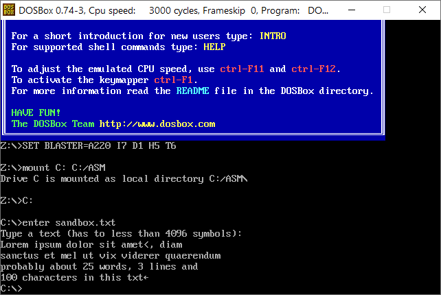
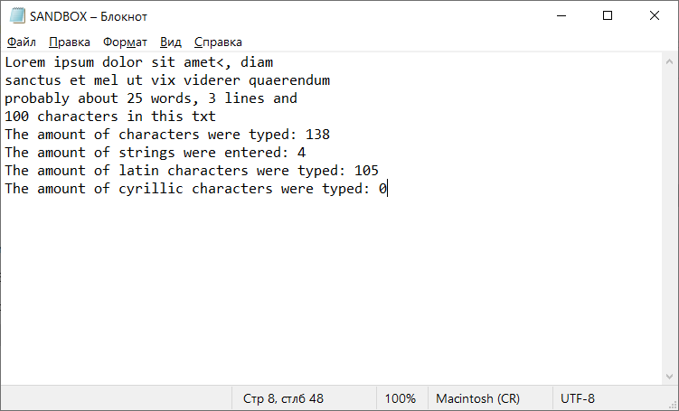
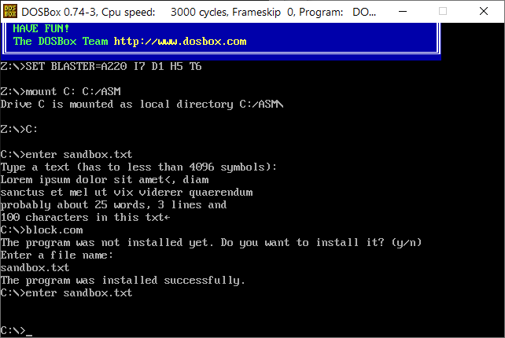
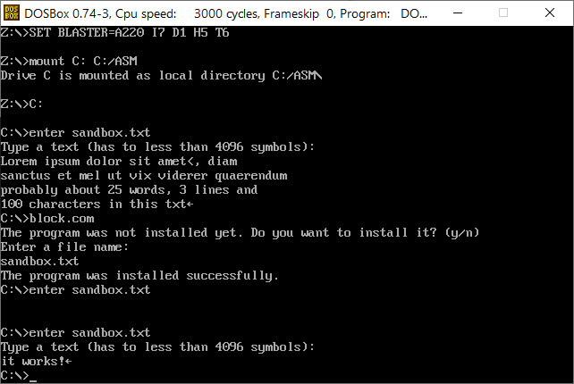

# Лабораторные работы по ассемблеру

### Задания лабораторных работ

>1. Запросить имя файла, если оно не указано в командной строке. закисать в файл массив символов, который вводится с клавиатуры. В конец файла дописать информацию - сколько символов было введено, сколько строк, сколько кириллических символов, сколько латинских символов. 

>2. TSR-программа по горячей клавише блокирует доступ к определенному файлу, имя которого задается в качестве параметра при запуске TSR-программы. При повторном нажатии деблокирует доступ к этому файлу. 

Исходный код находится в ```/source```, собранные ```.com``` файлы в ```/target```

### Описание работы программ

#### Первая программа ```enter.com```

>Имя файла с расширением или без задаётся при запуске программы в качестве аргумента командной строки. Если командная строка пустая, то выводиться предложение для пользователя задать имя файла. Имя файла можно задавать с расширением или без. Пользователь вводит имя файла. С этого момента разрешается ввод. Пользователь вводит текст. После нажатия каждой клавиши происходит проверка символа для итоговой статистики. По нажатию клавиши **«esc»** ввод завершается. Начинается запись статистики в файл. В конец файла записываются данные по одной строке о количестве символов, строк, кириллических и латинских символов. Программа завершается. **Важно**: ограничение на 128 символов в названии файла и 4096 символов в файле для исключения переполнения ОЗУ (в 64Кб)

#### Вторая программа ```block.com```

>Запрашиваем у пользователя разрешение на установку программы в оперативную память. После разрешения запрашиваем имя файла, который собираемся блокировать. Запоминаем его и храним. По нажатию на клавишу **«F10»** доступ к файлу блокируется и другие программы не имеют к нему доступа. После обратного нажатия, файл деблокируется. При вызове ```block.com``` при установленной программе выполняется диалог удаления. **Важно**: если при этом файл не был деблокирован обратно, то программа продолжает работать в режиме passthrough - висит в памяти, но не выполняет никакие команды, т.к. не происходит возврата векторов прерывания в исходную позицию.

### Скриншоты работы








